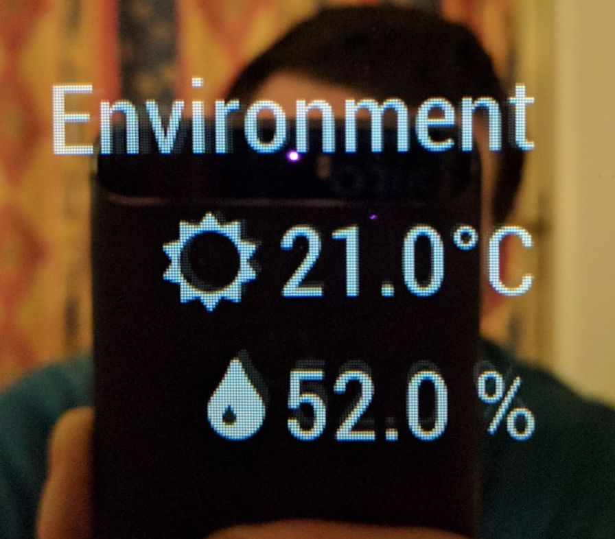

# MMM-DHT-Sensor
###Work in progress

This an extension for the [MagicMirror](https://github.com/MichMich/MagicMirror). 

It monitors temperature and humidity from [DHT11 sensor](https://www.adafruit.com/product/386).

Used on my personal [Smart mirror project](https://github.com/bernardpletikosa/smart-mirror)



## Installation
1. Navigate into your MagicMirror's `modules` folder 
2. Clone repository `git clone https://github.com/bernardpletikosa/MMM-DHT-Sensor`
3. Go to newly created directory
4. Execute `npm install` to install the node dependencies.

## Using the module

Add it to the modules array in the `config/config.js` file:

````javascript
modules: [
	...
	{
		module: 'MMM-DHT-Sensor',
		config: {
			// See below for more information.
		}
	}
	...
]
````

## Configuration options

Configurations properties


<table width="100%">
	<thead>
		<tr>
			<th>Property</th>
			<th width="100%">Description</th>
		</tr>
	<thead>
	<tbody>
		<tr>
			<td><code>sensorType</code></td>
			<td>TODO
				<br><b>Type:</b> <code>int</code>
				<br><b>Default:</b> <code>11</code>
			</td>
		</tr>
		<tr>
			<td><code>sensorPIN</code></td>
			<td>The BCM pin your sensor is connected to
				<br><b>Type:</b> <code>int</code>
				<br><b>Default:</b> <code>4</code>
			</td>
		</tr>
		<tr>
			<td><code>updateInterval</code></td>
			<td>Wait interval between readings of temperature and humidity values
				<br><b>Type:</b> <code>int</code>
				<br><b>Default:</b> <code>2000 ms</code>
			</td>
		</tr>
		<tr>
			<td><code>animationSpeed</code></td>
			<td>Animation of changes
				<br><b>Type:</b> <code>int</code>
				<br><b>Default:</b> <code>0</code>
			</td>
		</tr>
		<tr>
			<td><code>titleText</code></td>
			<td>Widget title text
				<br><b>Type:</b> <code>string</code>
				<br><b>Default:</b> <code>DHT</code>
			</td>
		</tr>
		<tr>
			<td><code>units</code></td>
			<td>Unit system to use
				<br><b>Type:</b> <code>string</code>
				<br><b>Default:</b> <code>from default configuration</code>
			</td>
		</tr>
	</tbody>
</table>

## Developer Notes
For more details abput BCM pin numbers check [here](http://www.raspberrypi-spy.co.uk/2012/06/simple-guide-to-the-rpi-gpio-header-and-pins]

## Dependencies
- [dht-sensor](https://github.com/roland-vachter/rpi-dht-sensor) (installed via `npm install`)

Thanks to [roland-vachter](https://github.com/roland-vachter) and [momenso](https://github.com/momenso) for the library.
